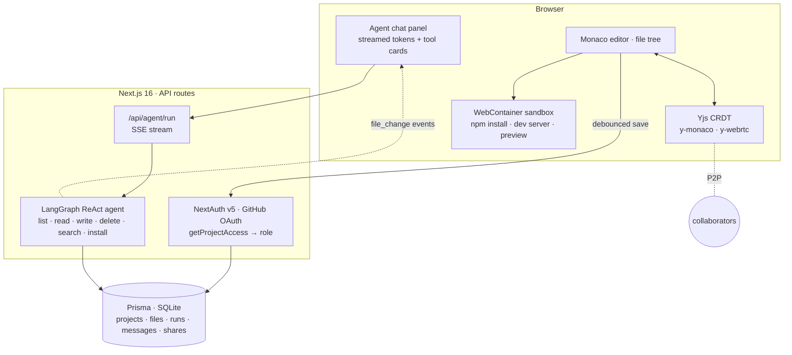

# Jenil Savalia

**Software Engineer · AI Developer**

I build AI-native software — LLM agents, retrieval & evaluation pipelines, and the backend systems that make them safe to ship.

Software Engineer Intern @ Settlyfe &nbsp;·&nbsp; M.S. Applied Data Science @ San José State University ('27) &nbsp;·&nbsp; San Jose, CA

 

## What I build

- 🤖 **Agentic systems** — LangGraph ReAct agents with typed tools, streamed tool calls, and multi-agent fan-out → [Agentic Software Platform](https://github.com/Jenil133/Agentic-Software-Platform), [OTTO](https://github.com/Jenil133/OTTO), [Le Bistro](https://github.com/Jenil133/intelligent-bistro-viridien)
- 🔎 **Retrieval + evaluation** — embeddings, hybrid vector search, guardrails, and eval harnesses that gate releases → [FilmFinder](https://github.com/Jenil133/FilmFinder), [LedgerLens](https://github.com/Jenil133/Ledger-Lens), [vision-eval-harness](https://github.com/Jenil133/Automated-Vision-Model-Validation-Harness)
- ⚙️ **Backend & data systems** — FastAPI / Go / Spring Boot services on Postgres & Redis — containerized, CI-gated, observable → [Baseline](https://github.com/Jenil133/Sensor-to-App-Signal-Processing-), [Digital Intelligence](https://github.com/Jenil133/Digital-Intelligence), [BookTable](https://github.com/Jenil133/book-table)

The pattern across all of them: **deterministic core, LLM at the edges, and a test, eval, or guardrail in front of every model output.**

 

## Featured projects

<table>
  <tr>
    <td width="50%" valign="top">
      <h3><a href="https://github.com/Jenil133/Agentic-Software-Platform">🧠 Agentic Software Platform</a></h3>
      
<em>An in-browser IDE where an AI agent is a first-class collaborator, not autocomplete.</em>

      
Monaco editor + WebContainer sandbox in the browser; a <b>LangGraph ReAct agent</b> with six Zod-typed tools (list / read / write / delete / search / install) edits the project live over an <b>SSE event stream</b>; <b>Yjs CRDT</b> multiplayer editing with live cursors and share-link roles; GitHub OAuth; every agent run and tool call persisted.

      
<code>Next.js 16</code> <code>TypeScript</code> <code>LangChain / LangGraph</code> <code>Yjs</code> <code>WebContainers</code> <code>Prisma</code>

    </td>
    <td width="50%" valign="top">
      <h3><a href="https://github.com/Jenil133/Ledger-Lens">🧾 LedgerLens</a></h3>
      
<em>The accounts-payable inbox that reads invoices — and never auto-pays.</em>

      
PDF → SHA-256 dedup → parse / OCR → LLM classification + field extraction (16-node <b>RocketRide</b> pipeline) → a deterministic <b>Postgres</b> brain (three-layer dedup, guard rules, anomaly stats) → human review queue. The same graph runs on a laptop (Ollama) or in the cloud (Gemini); a 43-doc synthetic corpus and eval results are committed — 100% clean / 94.3% scanned field accuracy, 0 payable-queue leaks.

      
<code>RocketRide</code> <code>Next.js 16</code> <code>Supabase · Postgres · pgvector · RLS</code> <code>Gemini / Ollama</code> <code>Vercel</code> <code>Vitest</code>

    </td>
  </tr>
  <tr>
    <td width="50%" valign="top">
      <h3><a href="https://github.com/Jenil133/FilmFinder">🎬 FilmFinder</a> &nbsp;<a href="https://filmfinder-3w3t24wvvcf7xsbgj32jhx.streamlit.app">live demo ↗</a></h3>
      
<em>Ctrl+F for game film — search a soccer match in plain English.</em>

      
A vision LLM captions frames once, offline; at query time <b>FastEmbed + Qdrant hybrid search</b> fuses a dense vector with action and time filters, so <i>"saves in the last 10 minutes"</i> is a sub-second query. Two Lyzr agents sit behind flags with plain-Python fallbacks, a circuit breaker, and a code-enforced <b>grounding gate</b>; the eval harness scores 12/12 at rank 1 (MRR 1.00) — and caught a real agent bug on day one.

      
<code>Python</code> <code>Streamlit</code> <code>Qdrant</code> <code>Gemini</code> <code>FastEmbed</code> <code>Lyzr</code>

    </td>
    <td width="50%" valign="top">
      <h3><a href="https://github.com/Jenil133/Automated-Vision-Model-Validation-Harness">📊 vision-eval-harness</a> &nbsp;<a href="https://jenil133.github.io/Automated-Vision-Model-Validation-Harness/">live reports ↗</a></h3>
      
<em>CI for model quality — a statistical release gate for ML models.</em>

      
Runs vision and LLM eval suites, then blocks the merge only when a candidate is <i>genuinely</i> worse than a checksummed golden baseline: paired exact <b>McNemar</b>, <b>Benjamini–Hochberg</b> across suites, PSI / KS drift, bootstrap CIs. Async LLM runner with token-bucket rate limiting and a SQLite response cache; parallel, quarantining transcript ETL; Typer CLI with an exit-code contract; GitHub Actions gate.

      
<code>Python 3.11 / 3.12</code> <code>Typer</code> <code>SQLite</code> <code>SciPy</code> <code>httpx</code> <code>Jinja2</code> <code>GitHub Actions</code>

    </td>
  </tr>
  <tr>
    <td width="50%" valign="top">
      <h3><a href="https://github.com/Jenil133/Sensor-to-App-Signal-Processing-">🫀 Baseline</a> &nbsp;<a href="https://jenil133.github.io/Sensor-to-App-Signal-Processing-/">live demo ↗</a></h3>
      
<em>A biometric platform that learns <b>your</b> normal and flags when your body drifts from it.</em>

      
Encrypted-at-rest ingest (FastAPI + Fernet), Hampel + zero-phase Butterworth filtering, personal median / MAD baselines, and four detectors — z-score, <b>CUSUM</b>, <b>IsolationForest</b>, and a per-user <b>PyTorch autoencoder</b> — feeding an offline-first <b>React PWA</b> whose IndexedDB outbox syncs itself when connectivity returns. Full stack in one <code>docker compose up</code>.

      
<code>Python</code> <code>FastAPI</code> <code>PostgreSQL</code> <code>SQLAlchemy / Alembic</code> <code>PyTorch</code> <code>scikit-learn</code> <code>React 19</code> <code>PWA</code> <code>Docker</code>

    </td>
    <td width="50%" valign="top">
      <h3><a href="https://github.com/Jenil133/book-table">🍽️ BookTable</a></h3>
      
<em>Restaurant table reservations, end to end.</em>

      
<b>Spring Boot</b> REST API secured with Spring Security (JWT + Google OAuth2) over <b>MongoDB</b> — customers, restaurant managers, and admins each get their own surface; <b>React + Material UI</b> frontend wired through an Axios service layer; Docker Compose for the full stack and GitHub Actions CI/CD deploying to <b>AWS EC2 / S3</b>.

      
<code>Java 21</code> <code>Spring Boot</code> <code>MongoDB</code> <code>React</code> <code>Material UI</code> <code>Docker</code> <code>GitHub Actions</code> <code>AWS</code>

    </td>
  </tr>
</table>

<b>How the Agentic Software Platform fits together</b>

 

 

### Also built

| Project | What it is | Stack |
|---|---|---|
| [OTTO](https://github.com/Jenil133/OTTO) | Voice-first web-agent fleet: a planner splits one spoken ask into up to three read-only subtasks, fans them out to parallel browser agents, and a synthesizer speaks the answer — one typed event stream drives the whole ops console; mock mode replays it with zero backend (hackathon build) | Python · FastAPI · asyncio · React |
| [Le Bistro](https://github.com/Jenil133/intelligent-bistro-viridien) | Mobile ordering app where an LLM manages the cart through validated, structured tool calls; provider strategy for Claude / OpenAI / Groq, output sanitizer with fuzzy item resolution, Vitest suite | Expo / React Native · Hono · Drizzle + SQLite · Zod |
| [Digital Intelligence](https://github.com/Jenil133/Digital-Intelligence) | Go telemetry collector → Redis Streams → PySpark feature jobs; bearer auth, per-tenant rate limiting, OpenTelemetry tracing + Prometheus metrics, Helm charts, k6 load tests | Go · Redis · PySpark · Helm |
| [DocV Behavioral Prototype](https://github.com/Jenil133/Document-Verification-Prototype) | FastAPI scoring service with Pydantic session contracts and a reproducible synthetic dataset generator for bot-vs-human document-verification sessions | Python · FastAPI · Pydantic · pytest |

 

## Open source

Contributor to **[rocketride-org/rocketride-server](https://github.com/rocketride-org/rocketride-server)** — an open-source AI pipeline engine with a C++ core and Python-extensible nodes:

- [#2001](https://github.com/rocketride-org/rocketride-server/pull/2001) · merged — first unit tests for `rocketlib`'s `depends.py`; removed the duplicate cache tests
- [#1998](https://github.com/rocketride-org/rocketride-server/pull/1998) · merged — declare `pyjwt` so the published engine image starts
- [#2002](https://github.com/rocketride-org/rocketride-server/pull/2002) · open, approved — refresh the MCP tool catalog instead of caching it once

 

## Stack

| Area | Tools I reach for |
|---|---|
| **Languages** | Python · TypeScript / JavaScript · Go · Java · SQL |
| **AI / LLM** | LangChain · LangGraph · OpenAI / Gemini / Claude / Groq APIs · Ollama · FastEmbed & sentence embeddings · Qdrant · pgvector · Chroma · RocketRide pipelines · evals, guardrails & grounding gates |
| **Backend** | FastAPI · Next.js (App Router / API routes) · Spring Boot · Hono · REST · SSE / WebSockets · asyncio |
| **Data & storage** | PostgreSQL / Supabase · Redis Streams · MongoDB · SQLite · Prisma · Drizzle · SQLAlchemy / Alembic · PySpark |
| **ML / analytics** | PyTorch · scikit-learn · SciPy · pandas · statistical testing (McNemar, Benjamini–Hochberg, PSI / KS) |
| **Frontend** | React 19 · Next.js 16 · Tailwind · Expo / React Native · Monaco · Yjs CRDTs · PWA / Service Workers |
| **Infra & DevOps** | Docker / Compose · GitHub Actions · AWS (EC2, S3) · Vercel · GitHub Pages · Helm / Kubernetes · OpenTelemetry · Prometheus |

 

## Now

- 🏢 Software Engineer Intern @ **Settlyfe** — Java / Spring Boot microservices, PostgreSQL, Docker on AWS
- 🎓 M.S. Applied Data Science @ San José State University · graduating May 2027
- 🔭 Recently shipped: LedgerLens's cloud deploy + weekly digest pipeline, the `vision-eval-harness` CI gate and Pages reports, and my first merged PRs to RocketRide
- 🧭 Exploring next: multi-agent topologies (planner / coder / reviewer), codebase RAG on pgvector, and tracing + cost budgets for agent runs

 

## Contact

📫 [jenilsavalia058@gmail.com](mailto:jenilsavalia058@gmail.com) &nbsp;·&nbsp; [LinkedIn](https://www.linkedin.com/in/jenil-savalia-b2a111206/) &nbsp;·&nbsp; San Jose, CA

Open to Software Engineering and AI Engineering roles.
